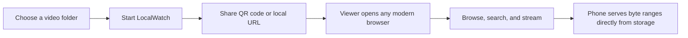
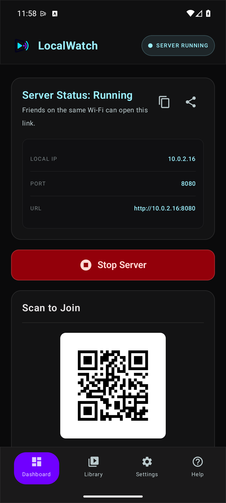
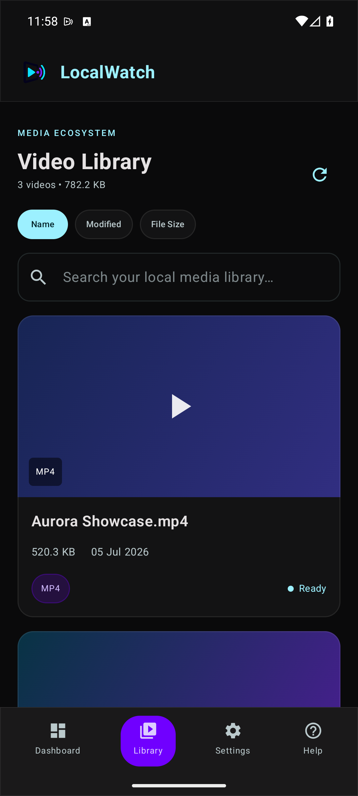
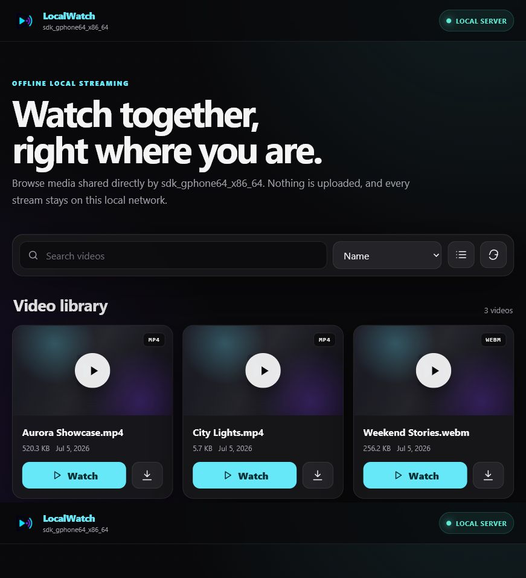

<div align="center">
  
  <h1>LocalWatch</h1>
  <p><strong>Your phone is the server. Your Wi-Fi is the cinema.</strong></p>
  <p>Share and stream a folder of videos to every browser on the same local network—privately, beautifully, and without an internet connection.</p>

  [](https://github.com/ahansardar/localwatch-server/releases/latest)
  [](https://github.com/ahansardar/localwatch-server/actions/workflows/android.yml)
  [](#requirements)
  [](LICENSE)

  [Download APK](https://github.com/ahansardar/localwatch-server/releases/latest) ·
  [Report a bug](https://github.com/ahansardar/localwatch-server/issues/new?template=bug_report.yml) ·
  [Request a feature](https://github.com/ahansardar/localwatch-server/issues/new?template=feature_request.yml)
</div>

---

LocalWatch turns an Android phone into a focused, offline media server. Choose a folder, start the server, and share the QR code. Nearby devices can browse a responsive library, search and sort videos, stream with byte-range seeking, or download files when the host allows it.

No account. No cloud library. No ads. No media leaving your network.

## What makes it useful

- **A real Android host app** — native Kotlin and Jetpack Compose, with clear server-off and server-on dashboards.
- **A browser-first viewer experience** — responsive library, grid/list modes, search, sorting, player, PIN screen, and useful error states.
- **Playback that can seek** — correct HTTP `Range`, `206 Partial Content`, `Content-Range`, and bounded streaming.
- **Private by design** — Android's system folder picker, persisted read-only access, opaque file IDs, and no exposed filesystem paths.
- **Host controls that matter** — optional PIN, optional downloads, configurable port, keep-awake, rescanning, recent clients, copy/share, and QR access.
- **Works without the internet** — the viewer UI, icons, styles, and player are served by the phone itself.
- **Hands-free app updates** — daily GitHub release checks, properly rendered Markdown notes, visible download progress, SHA-256 verification when available, and Android's installer flow.

## The flow



Everything stays between the host phone and devices reachable over the same Wi-Fi network or hotspot.

## Screenshots

<div align="center">
  
  &nbsp;&nbsp;
  
</div>

<br>



## Install

1. Download the signed APK from the [latest GitHub release](https://github.com/ahansardar/localwatch-server/releases/latest).
2. Allow installation from your browser or file manager if Android asks.
3. Open LocalWatch and choose the folder you want to share.
4. Start the server, then scan the QR code from another device.

> LocalWatch updates itself from this repository's public releases. Android may still require a one-time “Install unknown apps” permission and an installer confirmation; apps cannot bypass those operating-system protections.

## Requirements

- Android 8.0 / API 26 or newer on the host phone
- A Wi-Fi network or mobile hotspot shared by the host and viewers
- A modern browser on viewer devices
- MP4/H.264 for the widest browser compatibility

The scanner recognizes `.mp4`, `.mkv`, `.webm`, `.avi`, `.mov`, and `.m4v`. Whether a browser can play a file depends on the codecs inside it, not only the extension. Files a browser cannot decode can be opened in VLC or downloaded when the host enables downloads.

## Under the hood

| Layer | Technology | Responsibility |
| --- | --- | --- |
| Host UI | Kotlin, Jetpack Compose, Material 3 | Dashboard, library, settings, help, about, updater |
| Media access | Storage Access Framework, `DocumentFile` | Scoped, persisted access to the chosen folder |
| Local server | NanoHTTPD | Library API, PIN sessions, player, downloads, range streaming |
| Viewer | Embedded HTML, CSS, JavaScript | Fully offline responsive browser experience |
| Updates | WorkManager, GitHub Releases API | Daily checks, release notes, download, verification, install |
| Tests and CI | JUnit, Gradle, GitHub Actions | Range handling, web templates, Android build verification |

### Local endpoints

| Endpoint | Purpose |
| --- | --- |
| `/` | Library or PIN entry |
| `/auth` | PIN authentication |
| `/api/videos` | Safe JSON video index |
| `/api/status` | Local server status |
| `/watch?id=…` | Responsive player |
| `/stream?id=…` | Byte-range media stream |
| `/download?id=…` | Optional attachment download |

## Build it

Clone the repository, install JDK 17 and Android SDK 35, then run:

```bash
./gradlew testDebugUnitTest assembleDebug
```

On this project's Windows workstation, the included scripts keep the JDK, Android SDK, Gradle cache, temporary files, and Android user data on `F:`:

```powershell
Set-ExecutionPolicy -Scope Process Bypass
.\setup-toolchain-on-f.ps1
.\build-on-f.ps1 -Target debug
```

The debug APK is written to `app/build/outputs/apk/debug/app-debug.apk`.

### Signed release builds

Release signing comes from environment variables, so credentials never need to enter the repository:

```powershell
$env:LOCALWATCH_KEYSTORE = "F:\private\localwatch-release.jks"
$env:LOCALWATCH_STORE_PASSWORD = "your-store-password"
$env:LOCALWATCH_KEY_ALIAS = "localwatch-release"
$env:LOCALWATCH_KEY_PASSWORD = "your-key-password"
.\build-on-f.ps1 -Target release
```

Never commit a keystore or its passwords. Every update must be signed with the same key as the installed app.

## GitHub-powered updates

Official builds are preconfigured to check `ahansardar/localwatch-server`. Forks can override the update source at build time:

```powershell
$env:LOCALWATCH_GITHUB_REPO = "owner/repository"
.\build-on-f.ps1 -Target release
```

A full GitHub releases URL is also accepted, or the value can be placed in an uncommitted `local.properties` file:

```properties
LOCALWATCH_GITHUB_REPO=owner/repository
```

For every release:

1. Increase `versionCode` and `versionName` in `app/build.gradle.kts`.
2. Build the APK with the original release key.
3. Publish a non-draft, non-prerelease GitHub release with one installable `.apk`.
4. Write useful Markdown release notes—the app displays them as the update description.

## Privacy and security

LocalWatch has no account system, analytics, advertising SDK, or cloud media storage. It reads only the folder selected through Android's system picker. Recent client IP addresses exist only in memory.

Streaming uses plain HTTP because it is designed for a trusted local network. The optional PIN prevents casual access but is not transport encryption. Enable it on shared networks, and share only media you have the right to distribute.

Read the full [privacy notice](PRIVACY.md) and report sensitive issues using the process in [SECURITY.md](SECURITY.md).

## Limits worth knowing

- All viewers must be able to reach the host on the same Wi-Fi/hotspot.
- Some phones isolate hotspot clients; a regular Wi-Fi router may work better.
- Playback timing is independent on each device; synchronized playback is not promised.
- Browser codec support varies. MP4/H.264 is the safest choice.
- Hosting and streaming consume battery, storage bandwidth, and Wi-Fi capacity.
- Performance depends on the phone, storage, bitrate, and local network quality.

## Contributing

Thoughtful bug reports and focused pull requests are welcome. Start with [CONTRIBUTING.md](CONTRIBUTING.md), and please keep every visible control honest—if it appears in the UI, it should do something useful.

## Creator

Built and maintained by **[Ahan Sardar](https://github.com/ahansardar)** — I make ambitious ideas actually work.

[Portfolio](https://ahansardar.vercel.app) · [LinkedIn](https://www.linkedin.com/in/ahansardar) · [Email](mailto:ahansardarvis@gmail.com)

## License

LocalWatch is open source under the [MIT License](LICENSE).
